# 写在前面
NAGEKI MICRO 方案使用了六个`33*33mm主键`与两个`60*60mm方形侧键`，这一按键配置与官机有较大区别。虽然目前已经有一些比较成熟的高仿官机开源手台方案，如 [Umi4Life/NAGEKI-3.33](https://github.com/Umi4Life/NAGEKI-3.33)，但由于成本过高与制作难度较大，对于初心者来说并不友好。

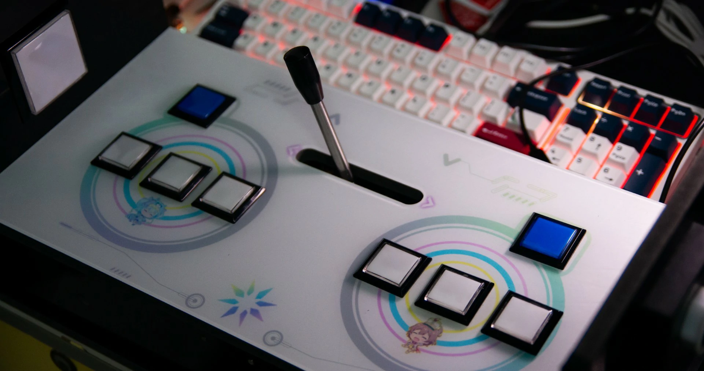
  
虽然本文所使用的方案并不能完全还原官机手感，但非常适合想体验音击但预算不足的玩家。经过我自己的测试，在组件恰当固定的前提下，完全能打高难度的谱面。当然，如果你追求完全还原官机的手感，建议还是考虑其他方案。
  
**需要注意的是，我对 NAGEKI 方案做了很多调整来保证最佳效果，因此不建议同时参考两篇教程。**
# 前提准备
你需要拥有一定的**动手能力**、**编程基础**和**基础焊接技能**，同时也需要拥有对应的工具。

此外，你需要自行配置 ONGEKI 游戏本体，请自行寻找教程，本文此处不再赘述。
# 材料列表
如果你只追求游玩体验，那么只需要考虑必选的材料。如果你对手台的外观等方面有一定要求，可以看看可选材料。
## 必须
 - PVC材质 NAGEKI MICRO 外壳（TB多美歌）（150CNY）
 - 100mm不锈钢杆 直径6mm（~5CNY）
 - ProMicro 5V（~35CNY）
 - 1\*4P直排针\*50（~3CNY）
 - NAGEKI PCB（嘉立创免费打样）
 - 33\*33按键\*8、60\*60按键\*2（~95CNY）
 - 微动开关\*10（~35CNY）
 - 轻按键弹簧\*8（~20CNY）
 - 机械键盘润轴油脂+笔（~7CNY）
 - 机床操作杆 M6\*110mm（~4CNY）
 - 各种杜邦线（公公、母母、公母）（~10CNY）
 - 鳄鱼夹杜邦线\*20（公转鳄鱼夹）（~10CNY）
 - 6mm六角联轴器 30mm长度（~5CNY）
 - 刚性联轴器 外径20 长25 内孔6*6（~5CNY）
 - 止动环 内径24 M6（~3CNY）
 - 单联电位器 B10K 20mm（~3CNY）
 - T型硅胶护线圈 内径22（~5CNY）
 - PVC胶水（~5CNY）

**总价约为400CNY**
## 可选
### 改善手台线路
> 由于该外壳开孔偏小，必须使用扁线才能穿孔，
> 当然你也可以自己把孔扩大一些。
 - TYPE-C 扁线

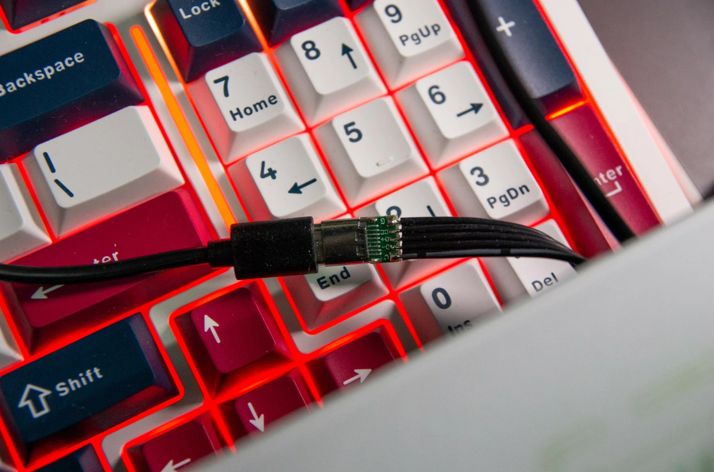

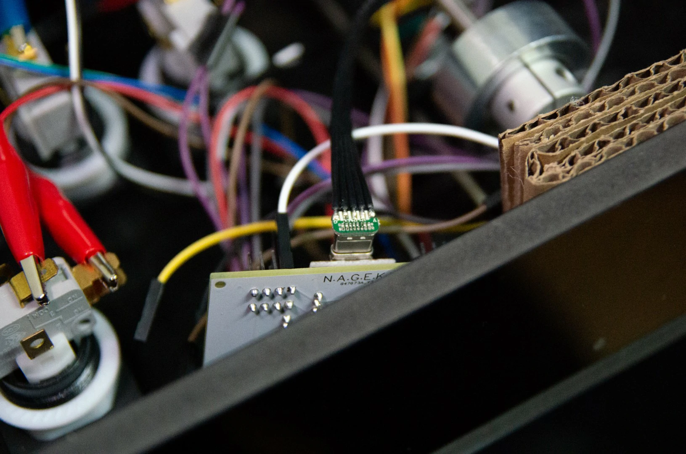
### 可拆卸底板
> 不建议直接把底板固定上去，用柜门磁吸片更便于维护。
 - 柜门磁吸片
### 按键灯光
> 单色灯光比较省事，当然你也可以自己捣鼓一下游戏灯光同步。
 - 5V LED
 - 鳄鱼夹杜邦线

# 技术细节
## NAGEKI PCB
[NAGEKI PCB V2.zip](https://github.com/Nana0Nana/NAGEKI/blob/main/NAGEKI%20PCB%20V2.zip)  
在此下载 PCB 制板文件，直接上传至嘉立创并下单即可。
## 按键弹簧的购买
由于音游的操作密度比较大，强烈建议选择力度较轻的弹簧，可以自行咨询店家。
## 开发板排针问题
有些 ProMicro 开发板会在底部多一排排针，但 NAGEKI PCB 上并没有为这排排针预留孔位，因此建议买未焊排针的开发板，自行焊接所需的排针。
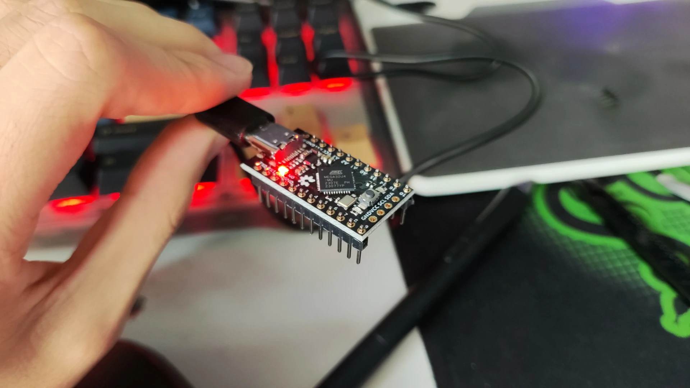
  
# 组装流程
在拿到大部分材料后，就可以开始着手组装了。
## 1.搭建外壳
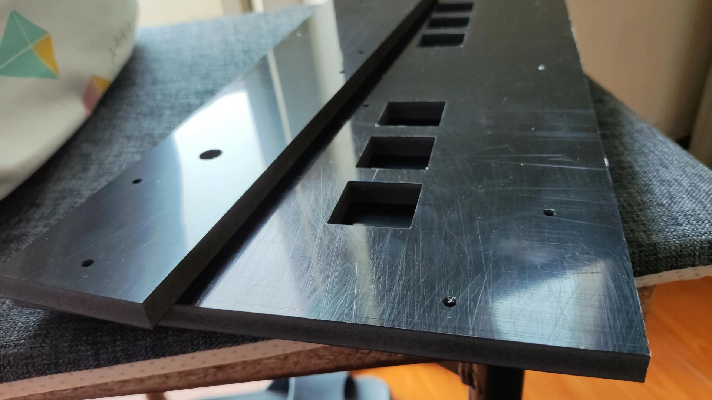

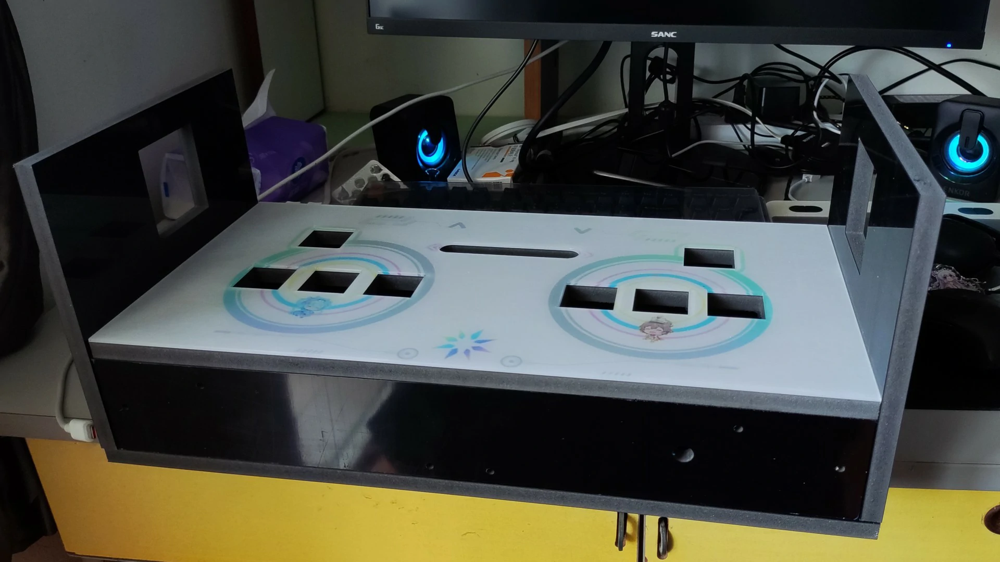

你可以选择使用 PVC 胶水粘合，也可以选择用自攻螺丝固定。如果要使用自攻螺丝，建议打孔后再上螺丝，避免损伤 PVC 外壳。

由于 PVC 胶水对该材质的粘性已经够强，此处我直接使用了这个比较省事的固定方案。

顶层彩印亚克力板无需自行固定，在安装按键后就会固定住。底板可以先不固定，便于处理内部线路。
## 2.安装按键
在安装前，建议先用机械键盘润轴油脂润滑一下，保证手感。

润滑完毕后，安装微动开关。对准两个短柱，将微动开关卡上去。

随后就可以把按键安装到外壳上了。
## 3.焊接开发板
焊接排针、开发板与 NAGEKI PCB。

## 4.焊接电位器
电位器有三个引脚，分别是 VCC、GND、模拟信号。由于杜邦线难以连接到电位器上，我将三根母对母杜邦线的一头剪开，并焊接到了电位器上，另一侧插到 PCB 上。

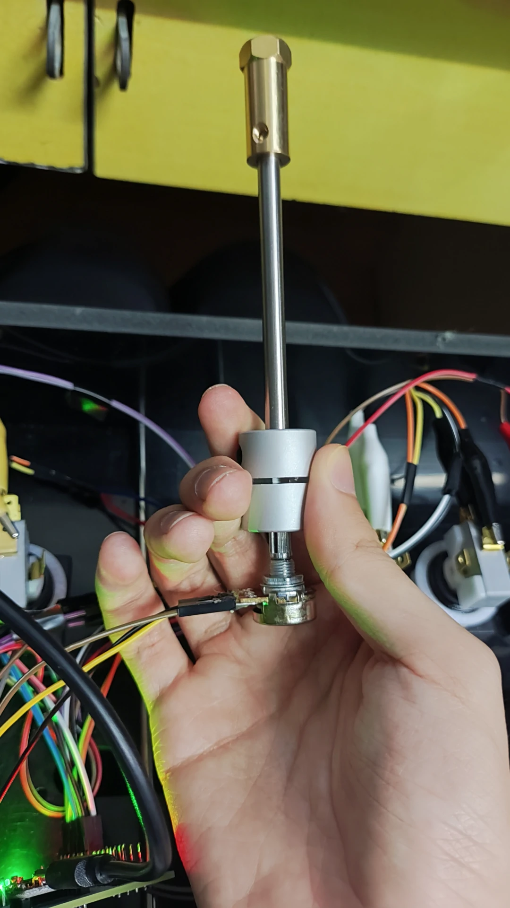

位于电位器两侧的引脚为VCC/GND，中间的引脚为模拟信号，接入 PCB 上的 A0 口。

## 5.摇杆组装
整个摇杆的结构：

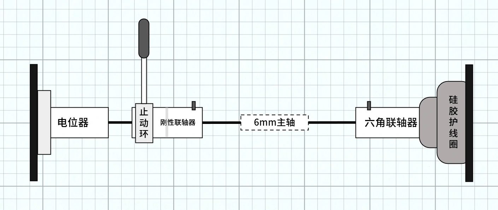

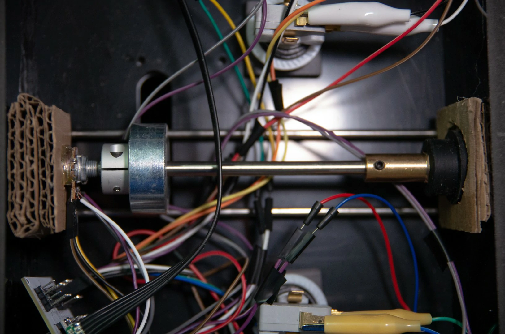

请务必将各个止动螺丝固定牢固，否则可能会产生摇杆漂移等问题。

由于这个台子比较小，我没有找到合适的固定方案，我使用了多层纸板+热熔胶固定，由于纸板纵向强度较强，结构稳定度还算可以。

## 6.接线
根据 PCB 上的印刷文本提示，将微动开关连接到 PCB 上（GND 和 IO 分别连接到微动开关的两个引脚）
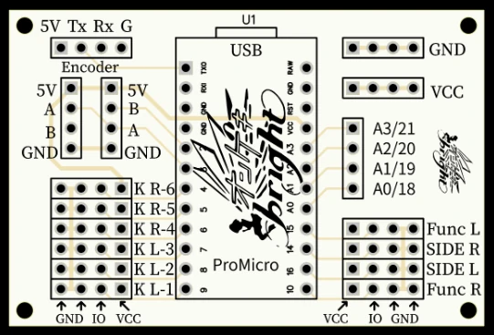
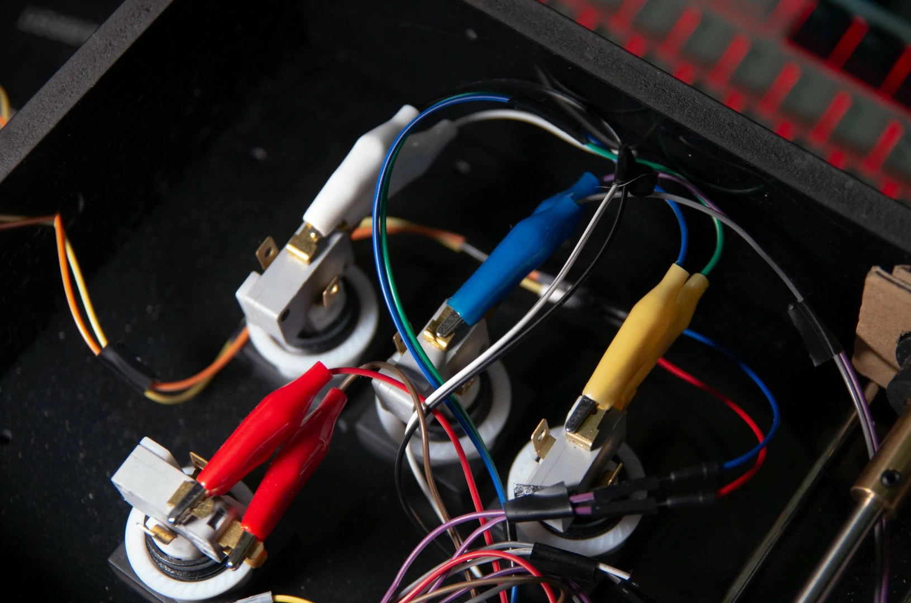

## 7.烧写软件
将 [ongeki-io](https://github.com/Nana0Nana/ongeki-io/tree/develop/mu3hid) 固件烧写到开发板上，Arduino IDE 的配置在此不再赘述。

如果开发版亮绿灯，则固件正常运行。

最后，如果你没有外接 aime 读卡器，你需要将卡号写入固件内。以下是示例代码：

> if(data->buttons[4] && data->buttons[9]) {
>     // 假设你的卡号是：66 14 22 53 21 60 74 99 33 11
>     // 则你需要将其转为十进制写入 aimi_id 中，如下：
>     data->aimi_id = {102,20,34,83,33,96,116,153,51,17};
>     data->scan = true;
> }

## 8.修改游戏 dll
按照 [ongeki-io/README.md](https://github.com/Nana0Nana/ongeki-io/blob/develop/README.md) 操作即可。

## 9.启动游戏！
如果你正确替换了 dll，游戏在启动时会弹出 NAGEKI 的界面，你可以在这个界面上测试你的所有手台功能。

如果你发现你的摇杆方向反了，你需要自行修改固件源码。

之后，进入游戏 test 模式并校准摇杆，最后回到 service 模式，按下两个menu刷卡。如果一切顺利的话，你就能正常游玩了。

## 10.更多的优化...
由于摇杆使用了电位器，其信号输入为模拟信号，因此难免产生数据抖动。我在固件内加入了滞后滤波算法来实现平滑，你也可以自行修改固件来实现类似的效果。

# 最后的最后
如果你还有别的问题，可以直接来问我。你可以加 `QQ2114085565` 或发邮件到 `ltfjx2333@gmail.com`。

**祝玩的开心:D**